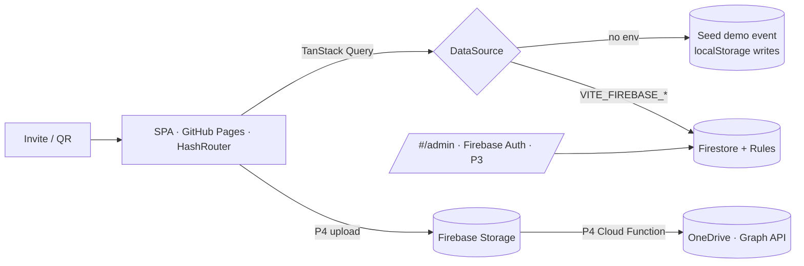

# Vow

**An event platform** — beautiful enough for a 20-guest civil ceremony, architected to run any future event without code changes. The first event: Michael & Dina, 18 September 2026, Ulm/Neu-Ulm.

React 19 · TypeScript (strict) · Vite · Tailwind v4 · motion (Framer Motion) · React Router (hash) · TanStack Query · React Hook Form + Zod · Lucide · Firebase (Firestore/Storage/Auth/Functions) · GitHub Pages.

Two themes mapped to the day itself: **Morning Garden** (light, default) and **Candlelit Evening** (dark). EN default, DE toggle. Design rationale: [DESIGN.md](DESIGN.md) · product: [PRODUCT.md](PRODUCT.md) · data model: [docs/SCHEMA.md](docs/SCHEMA.md).

## Status — honest ledger (Phase 1 of 4)

| Area | State |
|---|---|
| Design system: Tailwind tokens, both themes, visible glass-over-wash, skeletons | ✅ P1 |
| Landing: floating medallion slot, script mark, animated countdown, welcome, View Event | ✅ P1 |
| Guest identify (email/phone → local session) + personalized schedule (roles/guests) | ✅ P1 |
| Schedule cards: times, location, notes, Google/Apple/OSM links, visibility badges | ✅ P1 |
| RSVP: yes/no/maybe, dietary chips, allergies, message, contact, edit-until-deadline, confetti | ✅ P1 |
| Plus-one requests (guest side) | ✅ P1 |
| Motion: page transitions, staggered reveals, rolling countdown digits, hover/tap, reduced-motion | ✅ P1 |
| i18n EN/DE (chrome) + LocalizedText (content) | ✅ P1 — DE proofread pending |
| Data layer: `DataSource` seam, seed demo event, Firestore impl + Zod parsing | ✅ P1 — Firestore impl **not yet exercised** (no project) |
| Couple illustration | 🟡 slot + float built — art extracted from the couple's Canva in P2 |
| Hotels, weather, gallery, messages, live event mode, calendar, contact/parking/emergency, PWA | ⏳ P2 |
| Admin CMS: dashboard, guests (search/filter/sort/CRUD, exports, reminders), schedule/hotels/FAQ/gallery/messages editors, theme & content settings, plus-one approvals | ✅ P3 |
| Photos → Firebase Storage → Cloud Function → OneDrive | ⏳ P4 (needs Blaze + Azure app) |
| `firestore.rules` | ✅ hardened — content public-read, all personal data admin-only. Set `REPLACE_WITH_ADMIN_UID` before deploying |
| Deploy | ⏸ manual `workflow_dispatch` after the couple's audit |

**Content is placeholder by design** — the demo event (`event.placeholder: true`) shows a visible ribbon; the couple's real schedule/venues/texts are entered in the Admin CMS once confirmed. Nothing event-specific is hardcoded.

## Run locally

```bash
npm install
npm run dev        # http://localhost:4974
```

No setup needed — without Firebase env the app runs on the built-in seed event.
Demo guests for identify: `demo@vow.app` (Guest) · `witness@vow.app` (Witness — sees a role-gated schedule item).
Admin CMS at `#/admin` — in demo mode any email with passphrase `demo` (this is **not** security; there is no backend, and the UI says so). Admin edits persist to `localStorage` under `vow.seed.db.v1`; clear it to restore the factory demo event.
Debug: append `?noanim=1` to render all motion settled (used for headless screenshots).

## Connect Firebase

Project **vow-1809** is registered and `.env.local` holds its config (gitignored; Firebase web
config is public by design — security lives in `firestore.rules`). Firebase **Analytics is
deliberately not installed**: no third-party tracking on this site.

Remaining console steps (owner only):

1. **Create the database** — Build → Firestore Database → *Create database* → **europe-west3
   (Frankfurt)**, production mode. *(Not yet done: the API currently reports `SERVICE_DISABLED`.)*
2. **Create the admin** — Build → Authentication → *Get started* → enable **Email/Password** →
   Users → *Add user*.
3. **Deploy the rules** — paste [`firestore.rules`](firestore.rules) into the Rules tab and replace
   `ADMIN_UID` (or `ADMIN_EMAIL`). Sign in at `#/admin` and the page prints both values for you.
4. **Import content** — `#/admin` → *Import starter content*. A fresh project is empty, so this
   writes the event, schedule, hotels, FAQ, messages, settings and demo guests, then you edit
   everything in the CMS.

Restart the dev server after changing `.env.local` — Vite reads env only at startup.

Phase 4 additionally needs the **Blaze plan** (Cloud Functions) and an **Azure app registration**
(Microsoft Graph → OneDrive sync).

### How guests identify without accounts

The site is static, so there is no server to authenticate guests. Rules therefore allow **`get` but
never `list`** on anything personal: the app hashes the typed email/phone (SHA-256, see
[`src/lib/contact.ts`](src/lib/contact.ts)) and reads `guestLookup/{hash}` → `guests/{unguessable-id}`.
Nothing is enumerable, so the guest list cannot be scraped. The residual exposure — someone who
learns a guest id could read or overwrite that one RSVP — is the same as a shared invite link, and
is called out in the rules file. True per-guest auth needs Anonymous Auth + a Cloud Function
(Phase 4).

## Architecture



Folder structure: `src/{app, pages, features/<domain>, components/ui, hooks, services/{data,firebase}, types, lib, animations, i18n, styles}`.

## Launch checklist

- [ ] Couple confirms real schedule/venues/texts → entered via Admin CMS (P3)
- [ ] Couple illustrations extracted from their Canva → `heroIllustrationUrl` (P2)
- [ ] German copy proofread by the couple (`src/i18n/de.ts` + content)
- [ ] Firebase project created & rules hardened; seed→Firestore switch verified
- [ ] Real-device pass (iOS Safari + Android) — pane verification can't cover feel
- [ ] Lighthouse ≥95 audit (P3 gate)
- [ ] Custom domain → workflow `base` = `/`
- [ ] Run **Deploy to Pages** from the Actions tab
