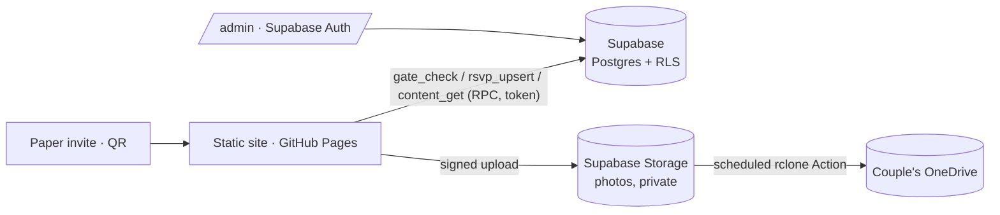

# Vow

Wedding website for **Michael & Dina** — Friday, **18 September 2026**, Ulm/Neu-Ulm.
Mobile-first, bilingual (EN default / DE), two themes mapped to the day itself:
**Morning Garden** (light, default) and **Candlelit Evening** (dark).

Design rationale lives in [DESIGN.md](DESIGN.md); product decisions in [PRODUCT.md](PRODUCT.md).

## Status — honest ledger

| Area | State |
|---|---|
| Design system (tokens, both themes, type) | ✅ built |
| Hero, schedule timeline, hotels, travel, asks, FAQ, footer | ✅ built |
| EN/DE dictionaries | ✅ built — **DE awaiting the couple's proofread** |
| Motion (sprig draw-on, gold thread scrub, section rises, reduced-motion) | ✅ built |
| Invitation gate | 🟡 UI built — **mock validation** (`DEMO` or any `?g=` link) |
| RSVP form | 🟡 UI built — **preview mode, saves to localStorage only** |
| Photos | 🟡 teaser panel only |
| Supabase (schema, RPCs, RLS) | 🟡 schema written, **project not created / not applied** |
| Admin panel (RSVP list, dietary export, chase links, menu editor) | ❌ not started |
| OneDrive photo sync | ❌ not started (design: Storage → rclone Action) |
| Character animation layer (mini Michael & Dina) | ⏸ deferred by decision — mounts reserved (`data-scene`) |
| Deploy | ⏸ intentionally manual (`workflow_dispatch`) — after the couple's audit |

## Run locally

```bash
npm install
npm run dev        # http://localhost:4974
```

Unlock the gated content with invite code `DEMO` (mock), or visit `/?g=anything`.
Booking code & emergency phone are **never in this repo**: copy
`content.local.example.json` → `public/content.local.json` (gitignored) for dev.

## Architecture



- **Config-driven & reusable**: structured data in `src/config/wedding.ts`, all copy in `src/i18n/`. Swap those, reuse the site.
- **Privacy rules**: no personal phone numbers, booking codes, or guest data in this public repo — runtime values come from Supabase `site_content` (token-gated RPC). Gallery & RSVP behind the guest gate.
- **GDPR**: fonts self-hosted (`@fontsource`), zero third-party requests, no analytics.
- **Glass budget**: exactly four backdrop-filter surfaces (topbar, gate, RSVP, photos) — see DESIGN.md.

## Connect Supabase (next phase)

1. Create a Supabase project (EU region — Frankfurt).
2. Apply `supabase/schema.sql` in the SQL editor.
3. Fill `site_content`: `booking_code`, `emergency_phone`, `menu_en`, `menu_de`.
4. Insert guests → each gets a `token`; personal links are `https://<site>/?g=<token>`.
5. Put the project URL + anon key in `.env` (`VITE_SUPABASE_URL`, `VITE_SUPABASE_ANON_KEY`) and swap `runtimeContent.ts` / `Rsvp.tsx` / `Gate.tsx` to the RPC calls (marked with comments).

## Launch checklist

- [ ] Couple proofreads German copy (`src/i18n/de.ts`) and approves all content
- [ ] Open question: are the two photo blocks (Münster / Friedrichsau) guest-facing?
- [ ] Hotel phone numbers added to `src/config/wedding.ts`
- [ ] Supabase connected; mock gate + preview RSVP replaced
- [ ] Character-animation decision (Rive vs. code-built storybook)
- [ ] Custom domain → set workflow `base` input to `/`
- [ ] Run **Deploy to Pages** from the Actions tab
